# WhatsApp Clone

A fully functional WhatsApp clone built with Flutter, featuring real-time messaging, media sharing, status updates, and group chat functionality. This project demonstrates modern mobile app development practices with a clean, intuitive UI that closely resembles the original WhatsApp interface.

## 🚀 Features

### Core Messaging
- **Real-time Chat**: Instant messaging with WebSocket integration
- **Media Sharing**: Send and receive images, videos, documents, and audio files
- **Emoji Support**: Full emoji picker with search functionality
- **Message Status**: Delivered and read indicators
- **Voice Messages**: Record and send voice notes

### Advanced Features
- **Camera Integration**: Built-in camera for capturing photos and videos
- **Image/Video Editing**: Rotate images, add captions, and basic editing tools
- **Group Chats**: Create and manage group conversations
- **Status Updates**: Share status updates with contacts
- **Contact Management**: Add, edit, and manage contacts
- **Voice & Video Calls**: Integrated calling functionality
- **Location Sharing**: Share current location with contacts

### UI/UX Features
- **Material Design**: Clean, modern WhatsApp-inspired interface
- **Dark/Light Theme**: Adaptive theming support
- **Smooth Animations**: Fluid transitions and micro-interactions
- **Responsive Design**: Optimized for various screen sizes
- **Custom Widgets**: Reusable UI components

## 🛠️ Tech Stack

### Frontend
- **Flutter**: Cross-platform mobile framework
- **Dart**: Programming language
- **Provider**: State management solution
- **Material Design**: UI component library

### Backend & Real-time Communication
- **Socket.IO**: Real-time bidirectional communication
- **Node.js Backend**: Server infrastructure
- **HTTP**: RESTful API communication

### Media & Storage
- **Camera Plugin**: Native camera integration
- **Image Picker**: Gallery and camera image selection
- **File Picker**: Document and file selection
- **Video Player**: Video playback functionality

### Additional Libraries
- **Emoji Picker**: Emoji selection and search
- **Country Picker**: International phone number support
- **OTP Text Field**: Authentication input fields
- **Geolocator**: Location services
- **Permission Handler**: Runtime permissions management

## 📱 Screenshots

The application features:
- **Chat Interface**: Clean messaging layout with bubble design  
  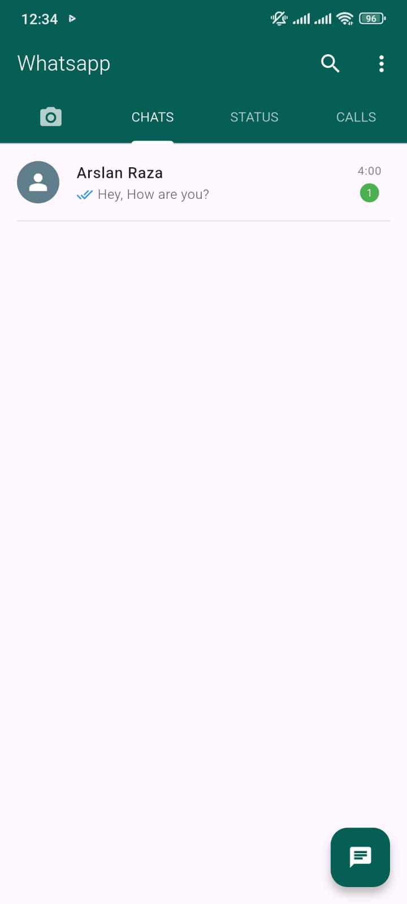
  
- **Specific Person Chat**: Chat with a specific person  
  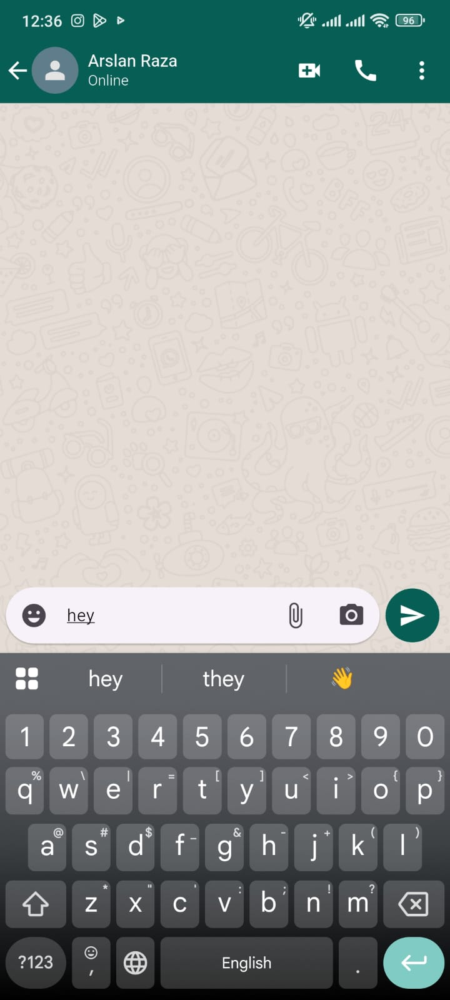

- **Send Message**: Send text messages seamlessly  
  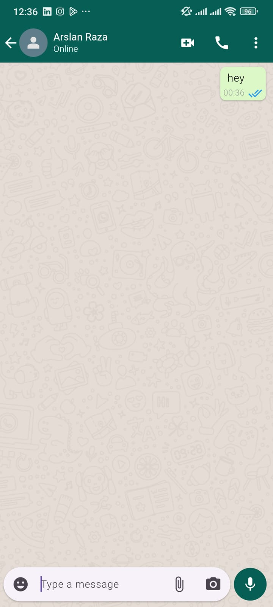

- **Emojis**: Add some fun with emojis  
  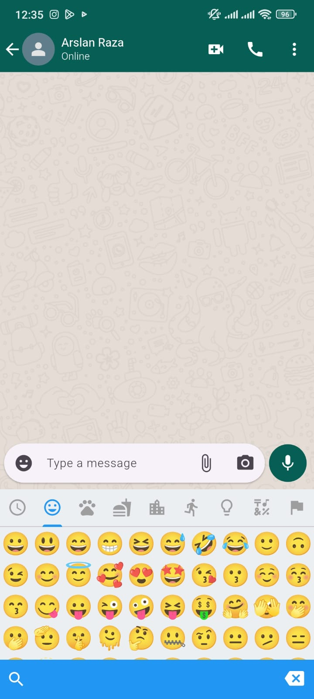

- **Select Photo**: Select photos from the gallery  
  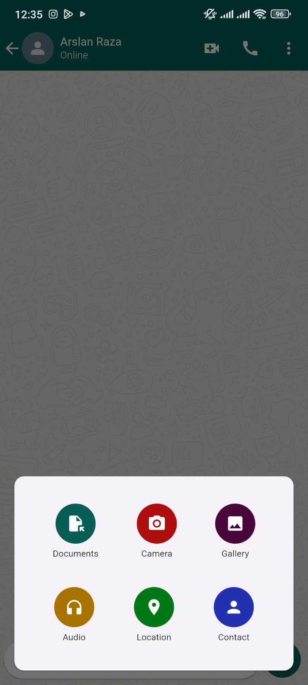

- **Photo Preview**: Preview the selected photo  
  

- **Photo Sent**: Send the selected photo  
  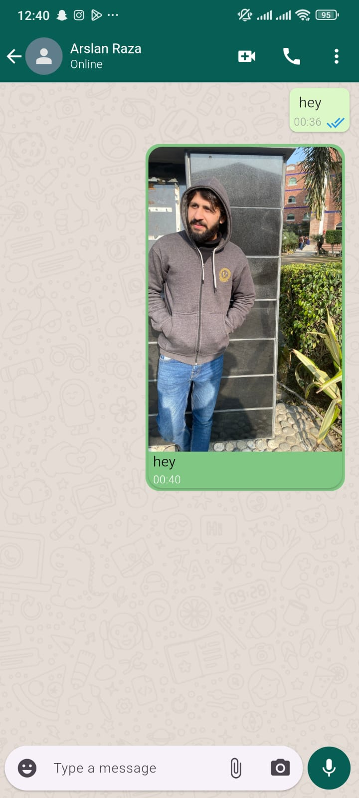

- **Status Page**: View the status page  
  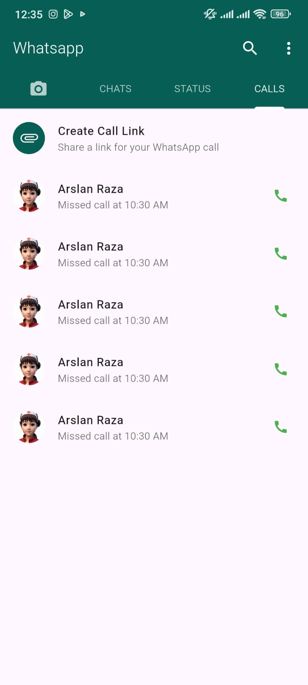

- **Call Page**: Call history and management  
  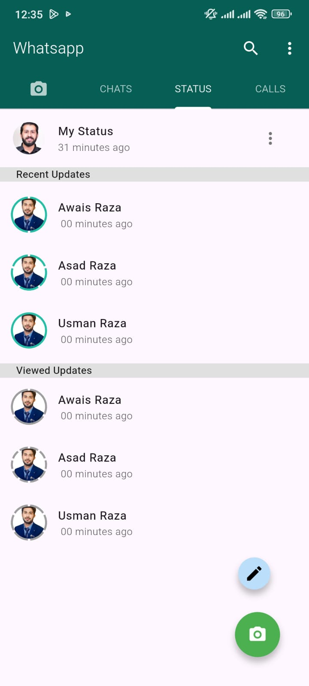

- **All Contacts**: Browse all your contacts  
  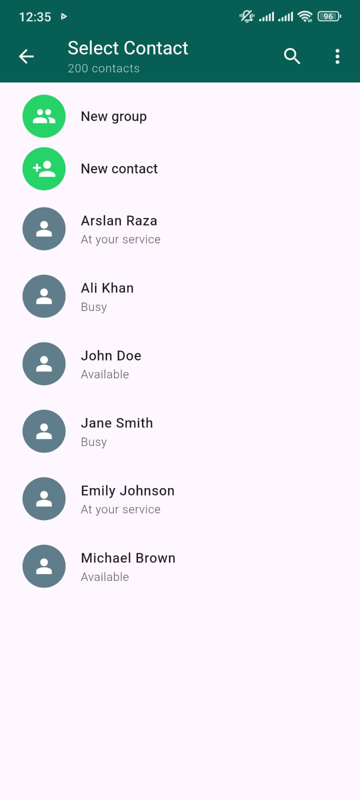

- **New Contact**: Add a new contact easily  
  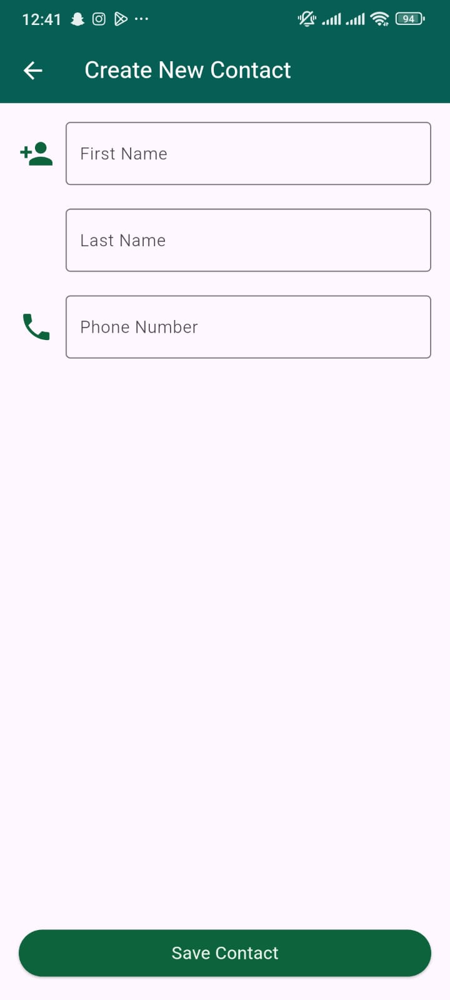

- **Create Group**: Create a new group chat  
  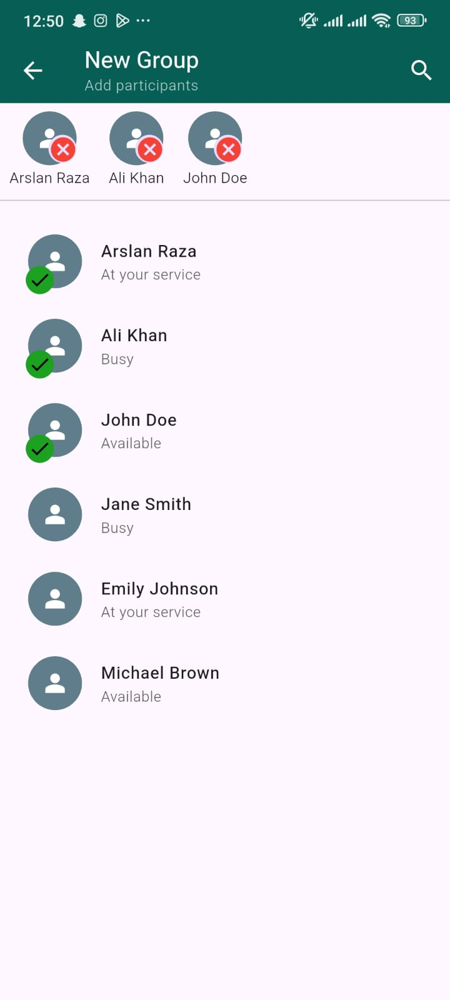

## 🏗️ Project Structure

```
lib/
├── custom_ui/              # Reusable UI components
│   ├── avatar_card_group.dart
│   ├── call_custom_card.dart
│   ├── chat_custom_card.dart
│   ├── contact_custom_card.dart
│   ├── own_message_card.dart
│   ├── reply_message_card.dart
│   └── status_pages/
├── models/                 # Data models
│   ├── chat_custom_card_model.dart
│   └── message_model.dart
├── pages/                  # Main application pages
│   ├── camera_page.dart
│   ├── chat_page.dart
│   ├── calls_page.dart
│   ├── status_page.dart
│   ├── specific_chat_screen.dart
│   └── share_data.dart
├── screens/                # Screen components
│   ├── home_screen.dart
│   ├── login_screen.dart
│   ├── select_contact.dart
│   ├── create_group.dart
│   └── camera_view.dart
└── new_screen/            # Authentication screens
    ├── landing_screen.dart
    ├── login_page.dart
    └── otp_screen.dart
```

## 🔧 Installation & Setup

### Prerequisites
- **Flutter SDK** (v3.0 or higher)
- **Dart SDK** (v2.17 or higher)
- **Android Studio** or **VS Code** with Flutter extensions
- **Node.js** (for backend server)

### Installation Steps

1. **Clone the repository**
   ```bash
   git clone https://github.com/arslanraza143/whatsapp-clone.git
   cd whatsapp-clone
   ```

2. **Install Flutter dependencies**
   ```bash
   flutter pub get
   ```

3. **Configure Backend Server**
   
   Update the socket connection URLs in `specific_chat_screen.dart`:
   ```dart
   socket = IO.io(
     "YOUR_BACKEND_SERVER_URL",
     <String, dynamic>{
       "transports": ["websocket"],
       "autoConnect": false,
     },
   );
   ```

4. **Add Required Assets**
   
   Ensure you have the following assets in your `assets/` folder:
   - `person.svg` - Default profile icon
   - `groups.svg` - Group chat icon
   - `bg.png` - Landing screen background
   - `whatsapp_background.png` - Chat background

5. **Configure Permissions**
   
   Add necessary permissions to `android/app/src/main/AndroidManifest.xml`:
   ```xml
   <uses-permission android:name="android.permission.CAMERA" />
   <uses-permission android:name="android.permission.RECORD_AUDIO" />
   <uses-permission android:name="android.permission.ACCESS_FINE_LOCATION" />
   <uses-permission android:name="android.permission.READ_EXTERNAL_STORAGE" />
   <uses-permission android:name="android.permission.WRITE_EXTERNAL_STORAGE" />
   ```

6. **Run the application**
   ```bash
   flutter run
   ```

## 📦 Dependencies

### Core Dependencies
```yaml
dependencies:
  flutter:
    sdk: flutter
  provider: ^6.0.5
  socket_io_client: ^2.0.3+1
  http: ^0.13.5

# UI & Media
  camera: ^0.10.5+5
  video_player: ^2.7.2
  image_picker: ^1.0.4
  file_picker: ^6.1.1
  emoji_picker_flutter: ^1.6.3

# Utilities
  country_picker: ^2.0.21
  otp_text_field_v2: ^1.0.0
  geolocator: ^10.1.0
  permission_handler: ^11.0.1
  flutter_svg: ^2.0.8
```

## 🌐 Backend Integration

The app integrates with a real-time backend server for:
- **Message Broadcasting**: Real-time message delivery
- **Media Upload**: Image and file sharing
- **User Authentication**: Phone number verification
- **Online Status**: User presence tracking

### API Endpoints
- `POST /routes/addImage` - Upload media files
- Socket events: `signin`, `message` - Real-time communication

## 🔒 Authentication Flow

1. **Landing Screen**: Welcome with terms acceptance
2. **Phone Number Entry**: International phone number input
3. **OTP Verification**: SMS-based verification
4. **User Selection**: Choose/create user profile
5. **Home Screen**: Access to full app features

## 📱 Key Features Implementation

### Real-time Messaging
- WebSocket connection for instant message delivery
- Message status tracking (sent, delivered, read)
- Offline message queuing

### Media Handling
- In-app camera with photo/video capture
- Gallery integration for media selection
- Image editing with caption support
- File and document sharing

### Group Management
- Create groups with multiple participants
- Add/remove group members
- Group admin controls

## 🚀 Deployment

### Android APK Build
```bash
flutter build apk --release
```

### iOS Build
```bash
flutter build ios --release
```

### Play Store Preparation
1. Update `android/app/build.gradle` with proper signing config
2. Generate signed APK/AAB
3. Follow Google Play Console guidelines

## 🤝 Contributing

We welcome contributions! Please follow these steps:

1. **Fork the repository**
2. **Create a feature branch**
   ```bash
   git checkout -b feature/amazing-feature
   ```
3. **Commit your changes**
   ```bash
   git commit -m 'Add some amazing feature'
   ```
4. **Push to the branch**
   ```bash
   git push origin feature/amazing-feature
   ```
5. **Open a Pull Request**

### Development Guidelines
- Follow Flutter/Dart coding conventions
- Add comments for complex logic
- Test on both Android and iOS
- Ensure responsive design
- Update documentation for new features

## 📄 License

This project is licensed under the MIT License - see the [LICENSE](LICENSE) file for details.

## 👨‍💻 Author

**Arslan Raza**
- **Email**: [arslanraza2022@gmail.com](mailto:arslanraza2022@gmail.com)
- **GitHub**: [@arslanraza143](https://github.com/arslanraza143)
- **LinkedIn**: [Connect with me](https://www.linkedin.com/in/muhammad-arslan-raza-202708171/)

## 🐛 Known Issues

- Video recording may require additional permissions on some devices
- Background app refresh needed for real-time notifications
- Large file uploads may timeout on slow connections

## 📞 Support

For support, bug reports, or feature requests:
- **Email**: [arslanraza2022@gmail.com](mailto:arslanraza2022@gmail.com)
- **Issues**: [GitHub Issues](https://github.com/arslanraza143/whatsapp-clone/issues)

## 🔮 Future Enhancements

- [ ] End-to-end encryption
- [ ] Voice/Video calling improvements
- [ ] Message reactions
- [ ] Advanced group permissions
- [ ] Cloud backup integration
- [ ] Multi-device sync
- [ ] Story reactions and replies
- [ ] Business account features

## ⭐ Acknowledgments

- Flutter team for the amazing framework
- WhatsApp for design inspiration
- Socket.IO for real-time communication
- Open source community for various packages

---

**⭐ Star this repository if you found it helpful!**

## 📊 Stats


